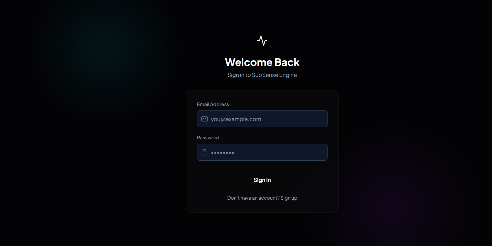
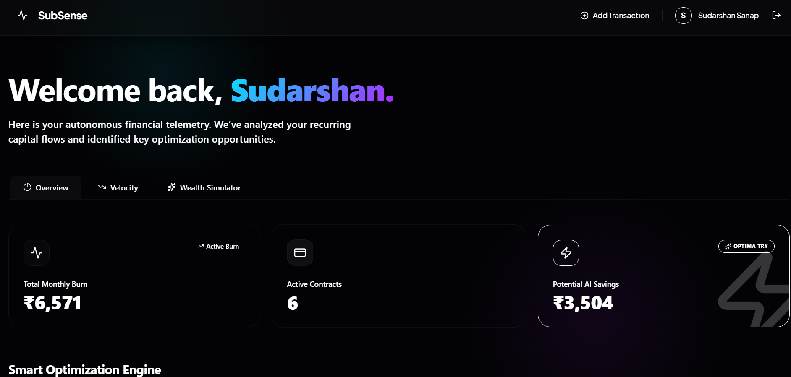
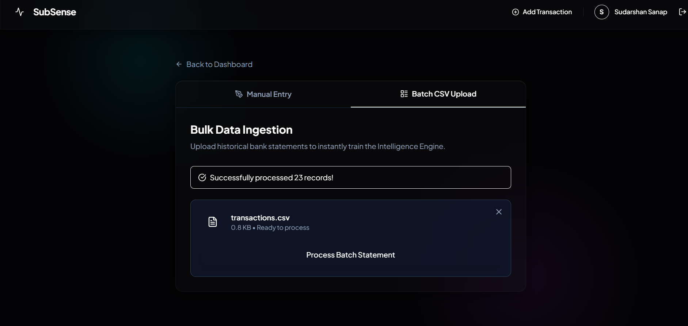
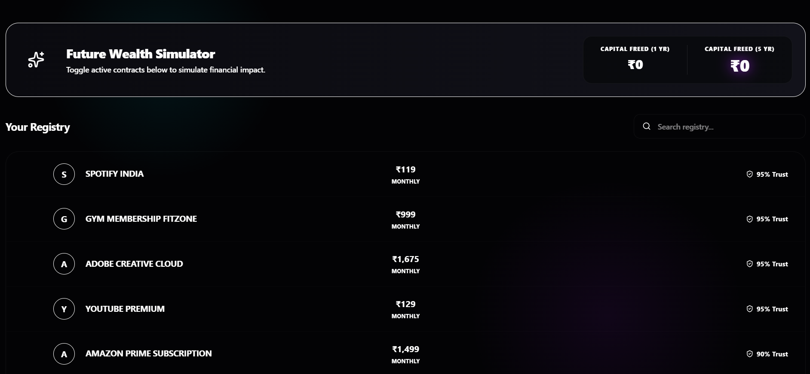

<div align="center">
  
  <h1>SubSense Engine</h1>
  <p><strong>A highly scalable, event-driven personal finance and subscription intelligence platform.</strong></p>

  [](https://java.com)
  [](https://spring.io/projects/spring-boot)
  [](https://reactjs.org/)
  [](https://kafka.apache.org/)
  [](https://postgresql.org)
  [](https://redis.io/)
</div>

---

## 🚀 About The Project

**SubSense** is a production-grade expense intelligence engine designed to combat "subscription fatigue." It utilizes a distributed microservices architecture to process massive streams of transaction data, utilizing heuristics and AI to automatically detect recurring payments, categorize spending, and provide actionable financial insights. 

Built with fintech standards in mind, the platform features robust security (JWT), asynchronous event processing (Kafka), caching layers (Redis), and advanced search capabilities (Elasticsearch).

---

## 📸 Screenshots

| Authentication | AI Dashboard & Telemetry |
| :---: | :---: |
|  |  |
| **Bulk Data Ingestion** | **Subscription Registry** |
|  |  |


---

## 🏗 Architecture & Technologies

SubSense is built using a **CQRS** and **Event-Driven Microservices** architecture to ensure high throughput and fault tolerance.

### 💻 Frontend (`subsense-ui`)
* **Framework:** React 18 (Vite)
* **Styling:** Premium Glassmorphic UI with Deep Dark Mode, modern typography, and CSS Gradients.
* **State Management:** Zustand
* **Features:** Dynamic animations, responsive layouts, data visualization.

### ⚙️ Backend Microservices (Spring Boot & Java 17)
1. **User Service:** Manages user registration, authentication, JWT generation, and role-based access.
2. **Transaction Service:** The ingestion pipeline. Receives CSV/Manual transactions and publishes them to Kafka topics. Built with strict idempotency to prevent duplicate charges.
3. **Subscription Engine:** The core analytical brain. Consumes Kafka events, detects recurring patterns, flags anomalies, and stores aggregated data in Postgres & Elasticsearch.
4. **Recommendation Engine:** Generates personalized financial insights and cancellation recommendations based on user spending velocity.

### 🗄 Infrastructure Layer (`docker-compose`)
* **Apache Kafka & Zookeeper:** Backbone for asynchronous inter-service communication.
* **PostgreSQL:** Primary ACID-compliant relational datastore.
* **Redis:** In-memory caching for lightning-fast Trust Scoring and JWT Token blocklisting.
* **Elasticsearch:** High-performance indexing for rapid transaction searching and analytics.

---

## ✨ Key Features
- **Event-Driven Data Pipeline:** Real-time processing of transactions using Kafka.
- **Automated Subscription Detection:** Identifies recurring charges and hidden fees.
- **Idempotency Standards:** FinTech-grade data processing guarantees no duplicate transactions.
- **Premium Glassmorphic UI:** A visually stunning, highly interactive modern web interface.
- **Scalable Architecture:** Fully containerized setup ready for global geographic deployment.

---

## 🛠 Getting Started

### Prerequisites
Make sure you have the following installed on your machine:
* [Java 17+](https://adoptium.net/)
* [Node.js (v18+)](https://nodejs.org/en/)
* [Maven](https://maven.apache.org/)
* [Docker & Docker Compose](https://www.docker.com/)

### Running Locally

**1. Start the Infrastructure (Databases & Messaging broker)**
```bash
docker-compose up -d
```
*(This starts PostgreSQL, Redis, Kafka, Zookeeper, and Elasticsearch).*

**2. Start the Backend Microservices**
Open separate terminals and run the following in each service directory (`user-service`, `transaction-service`, `subscription-engine`, `recommendation-engine`):
```bash
mvn spring-boot:run
```

**3. Start the Frontend UI**
```bash
cd subsense-ui
npm install
npm run dev
```

**4. Access the Application**
Navigate to `http://localhost:5173` in your browser.

---

<div align="center">
  <i>Developed with ❤️ by <a href="https://github.com/sudarshansanap9">Sudarshan Sanap</a>.</i>
</div>
